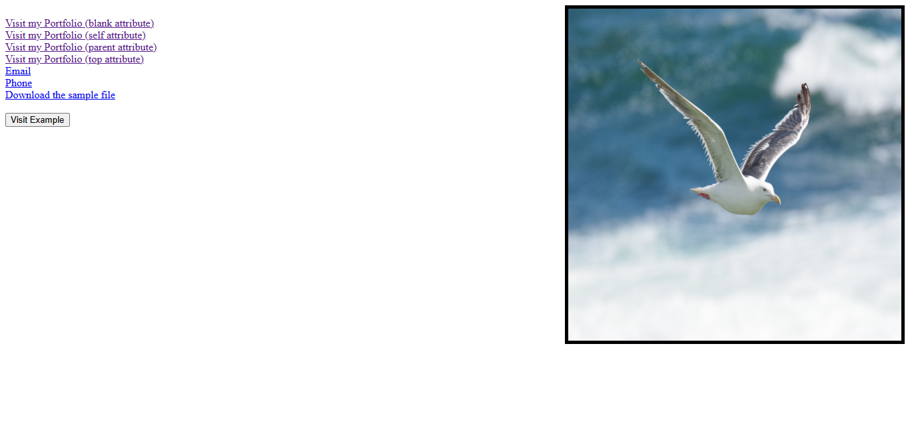
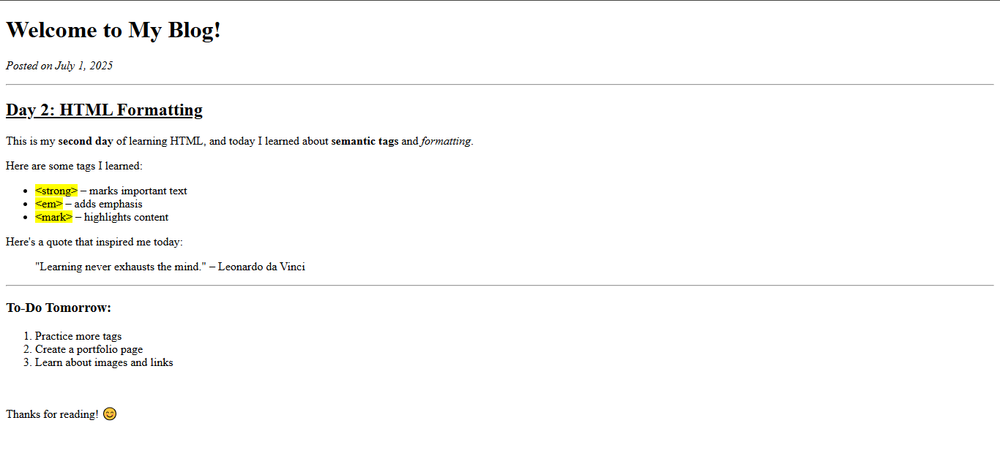

## HTML Attributes:
-> Attributes that are used within the opening tags of an HTML element.<br>
-> They provide the dditional informations about the HTML Element.<br>
-> Format: ```name = "value"```.<br>
-> This will tell the element how it should be appeared.<br>

## Syntax:
```<tagame name = "value">...</tagname>```

## Code:
```
<!DOCTYPE html>
<head>
    <title>Document</title>
</head>
<body>
    

    <a href="https://github.com/Panca2022/Panca-2022">Visit my Portfolio</a>
</body>
</html>
```

## Output:



## Explanation:
```title```: Defines the name that will be visible in the tab <br>
```strong```: This will bold the text<br>
```em```: It makes the text in itlic format<br> 
```u```: This underlines the text<br>
```b```: This also bolds the text<br>
```mark```: The mark gives teh bullet point figure to the list <br>
```&lt```: It is an entity which represents the Lesser than symbol<br>
```&gt```: It is an entity which represents the Greater than symbol<br>
```&copy```: n entity that is used to display copyright symbol<br>
```img```: This is the tag<br>
    -> ```src```: The attribute is src where it tells to show the image from the source link.<br>
    -> ```alt```: alt tells the alternative description for the image, which will be visible when the image is not visible.<br>
    -> ```width```: Defines the Width of the image.<br>
    -> ```height```: Defines the height of the image.<br>
    -> ```title```: The title will show some text, when the mouse hover over the image. Provides some additional detail about the image.<br>
```a```: It defines the hyperlink, were it redirects to another webpage.<br>
    -> Unvisited Link: Underlined and will be in Blue <br>
    -> Visited Link: Underlined and will be in Purple <br>
    -> Active Link: Underlined and Red<br>

### Some of Linking attributes as interlinking:
-> ```href```: Links to a website or any other format of document <br>
-> ```mailto```: Link to an email address <br>
-> ```tel```: Links to the Phone number <br>
-> ```button```: The provided link will be embedded in the format of button for the accessing<br>
-> ```download```: Provided with the link of the file to download<br>

### Links - Target Attributes
-> _blank = Opens the link in new tab or window <br>
-> _self = Opens in the same frame or window as the link, it's a default behaviour <br>
-> _parent = Opens document in the parent frame <br>
-> _top = Opens the document in the full body window <br>

## Text Formatting
-> Logical Formatting: Convey the meaning and importance of the text without necessarily altering the style of the visual apperance<br>
    - ```em```<br>
    - ```strong```<br>
-> Physical Formatting: Directly affects the visul appearance of the text on the webpage by changinf the font size and other styles <br>
    - ```b```<br>
    - ```i```<br>
## Some important points in Attributes usage:
- Use Lower case for attributes <br>
- Always quote attributes values <br>
- Usage of single or double quote is fine<br>
- Boolean attributes should be written without values<br>
- Proper attribute order for readability <br>
- Avoid using styles in the format of attributes. Use styles in the separate CSS files<br>
