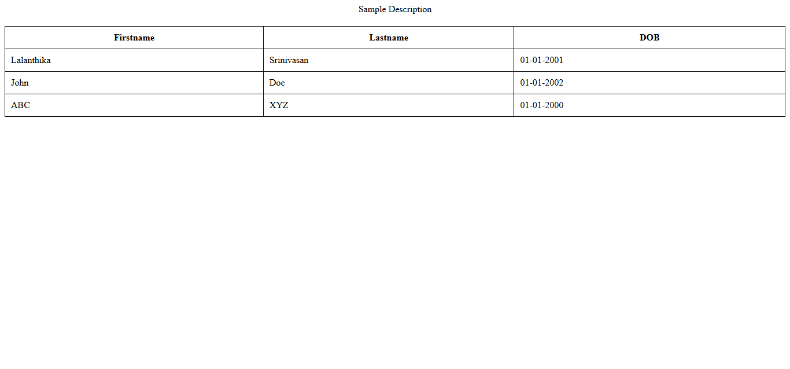
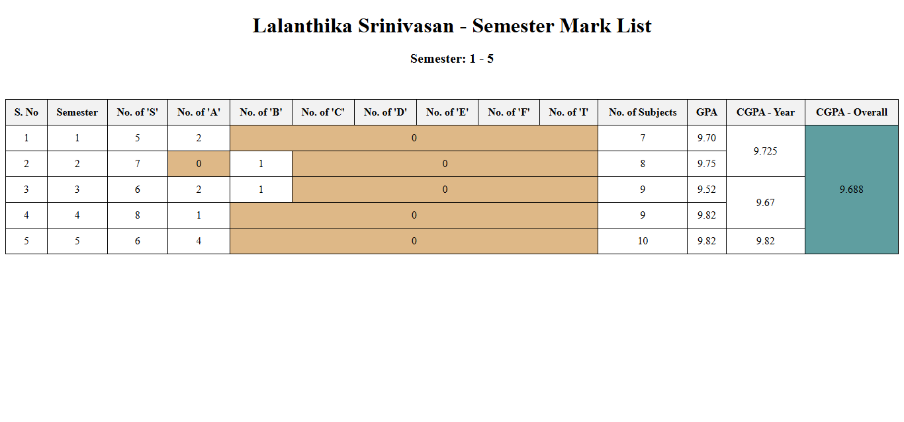

## HTML Table
- HTML Table is created using the ```table``` tag 
- ```tr```, ```th```, ```td``` is used for creation of the table 
- ```tr```: Represents the row 
- ```td```: Represents the data in the table 
- ```th```: Represents the table header

## Code:
```
<!DOCTYPE html>
<html lang="en">
<head>
    <title>Day 3 - Table Practice</title>
    <style>
        table{
            width: 100%;
            border-collapse: collapse;
        }
        th, td{
            border: 1px solid black;
            padding: 10px;
        }
        caption{
            font-size: 1em;
            margin-bottom: 20px;
        }
    </style>
</head>
<body>
    <table>
        <caption>Sample Description</caption>
        <tr>
            <th>Firstname</th>
            <th>Lastname</th>
            <th>DOB</th>
        </tr>
        <tr>
            <td>Lalanthika</td>
            <td>Srinivasan</td>
            <td>01-01-2001</td>
        </tr>
        <tr>
            <td>John</td>
            <td>Doe</td>
            <td>01-01-2002</td>
        </tr>
        <tr>
            <td>ABC</td>
            <td>XYZ</td>
            <td>01-01-2000</td>
        </tr>
    </table>
</body>
</html>
```

## Output:



## Explanation
```table```: It defines the structure to organize the data in rows and columns <br>
```caption```: It gives the heading to the table<br>
```thead```: Defines the header section of a table, often containing column labels.<br>
```tbody```: Defines the body section of a table, it contins the data of the table in rows and columns.<br>
```th```: Shows the table header cell tht typically holds title for the column.<br>
```td```: It holds content or data of the cell.<br>
```tfoot```: Footer of the table, which contains summaries or totals <br>
```col```: Defines the attributes for the table columns tht can be applied for multiple columns simutaneously.<br>
```colgroup```: Group set of colums of the table, formatting and applying properties can be done collectively.<br>
```colspan```: It groups the number of cells in column together which is given, into 1.<br>
```rowspan```: It groups the number of cells in rows together which is given, into 1.<br>
```border```: Add border to the table where it will specified with the border size and color<br>
```border-collapse```: It collapse the border into a single line.<br>
```padding```: Specifies the space between the borders and content.<br>
```text-align```: Defines the position of the text. Default one is Bold and center.<br>
```background-color```: Sets background color to the cells.<br>
